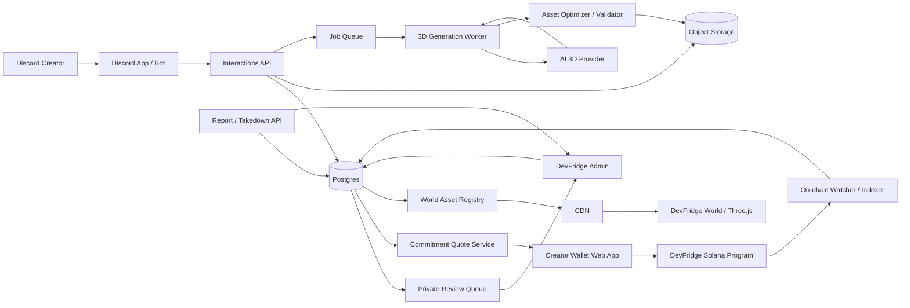
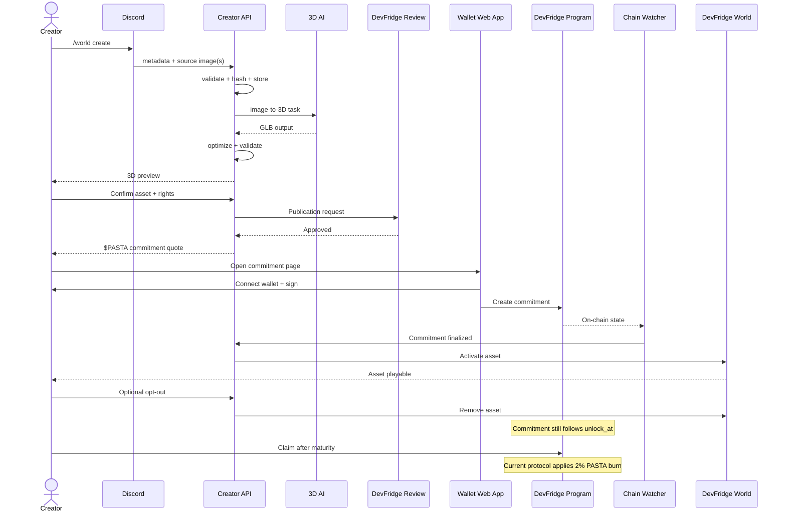

# DevFridge World Creator SDK for Discord

**Architecture & Product Specification**  
**Version:** 0.1  
**Date:** 2026-09-15  
**Status:** Proposed architecture / implementation blueprint

---

## 1. Executive summary

**DevFridge World Creator SDK for Discord** is a creator onboarding system that allows a Discord user to:

1. open a DevFridge creator flow directly from Discord;
2. upload one or more reference images;
3. provide asset metadata and confirm that they have the necessary rights to use the source material;
4. have an AI provider generate a game-ready 3D asset;
5. preview the generated asset;
6. approve the generated result and request publication;
7. submit the asset to DevFridge for moderation/review;
8. receive a **$PASTA commitment quote**;
9. connect a Solana wallet and create the required DevFridge commitment;
10. have the asset become eligible in **DevFridge World** for the same period covered by the commitment;
11. opt the asset out of the game at any time;
12. redeem the commitment according to the DevFridge smart-contract rules when the lock has matured;
13. have the protocol apply the current **2% $PASTA burn on redemption/claim**.

The central product principle is:

> **The asset lifetime follows the commitment lifetime.**

The commitment is not sent to DevFridge as a conventional purchase price. The principal remains governed by the DevFridge on-chain time-lock rules. However, because the current protocol burns 2% at redemption, the user still bears an economic cost. Product copy should therefore avoid describing the system as “free” or claiming that it has no economic cost.

The system must keep three concepts strictly separated:

- **IP / rights layer:** whether the user is allowed to submit and publish an asset.
- **Game distribution layer:** whether and how the asset appears inside DevFridge World.
- **Economic/on-chain layer:** the $PASTA commitment and its unlock/claim/burn rules.

A commitment never grants copyright, trademark, personality, likeness, or other IP rights.

---

# 2. Product thesis

DevFridge World should not act as a manually curated collection of famous meme characters uploaded by the DevFridge team.

Instead, DevFridge provides a **creator infrastructure**:

```text
Creator
  ↓
Discord Creator Flow
  ↓
Source image(s)
  ↓
AI-generated 3D asset
  ↓
Creator confirmation + rights declaration
  ↓
DevFridge publication review
  ↓
$PASTA commitment
  ↓
World eligibility
  ↓
Community adoption
```

This changes DevFridge World from:

> “a game where DevFridge publishes meme IP”

into:

> “a creator platform where communities generate, submit and activate their own playable assets.”

This is a much stronger long-term product model because new communities can continuously onboard without requiring DevFridge to create every character manually.

---

# 3. Core principles

## 3.1 Commitment is not an IP license

The platform must never imply:

```text
Commit $PASTA → receive permission to use someone else's character.
```

The correct model is:

```text
Rights permission
AND
DevFridge approval
AND
Valid $PASTA commitment
=
Asset eligible for DevFridge World
```

All three conditions are required.

---

## 3.2 Commitment controls time, not ownership

The recommended initial rule is:

```text
commitment period == maximum asset eligibility period
```

Example:

```text
commitment starts: 2026-10-01
unlock_at:         2026-10-31

maximum asset eligibility:
2026-10-01 → 2026-10-31
```

The asset can leave earlier because of:

- creator opt-out;
- rights complaint;
- moderation action;
- security issue;
- technical incompatibility;
- violation of DevFridge rules.

But the game backend must **never create an early unlock** unless the actual DevFridge smart contract explicitly supports one.

---

## 3.3 Asset opt-out and token unlock are different actions

This distinction is critical.

### Asset opt-out

The creator can request:

```text
ACTIVE → OPTED_OUT
```

The asset should disappear from new game sessions as quickly as technically possible.

### Commitment unlock

The creator's $PASTA remains governed by:

```text
unlock_at
```

from the on-chain DevFridge commitment.

Therefore:

```text
asset removed from game
≠
commitment automatically unlocked
```

At the contractual unlock time, the user can use the normal DevFridge claim/redeem mechanism. Under the current intended $PASTA mechanism, the 2% claim portion is burned and the remaining amount is returned according to the protocol rules.

---

## 3.4 Do not promise market-cap protection

The commitment can temporarily reduce the amount of $PASTA immediately transferable by the committing wallet.

It does **not** guarantee:

- token price;
- market cap;
- liquidity;
- absence of selling;
- appreciation;
- protection from a dump.

Recommended wording:

> “Commitments temporarily lock the committed balance under the DevFridge program rules.”

Avoid:

> “The SDK protects $PASTA market cap.”

---

# 4. User experience

## 4.1 Primary Discord command

Recommended command namespace:

```text
/world
```

Subcommands:

```text
/world create
/world status
/world preview
/world my-assets
/world optout
/world report
/world help
```

Admin-only:

```text
/world-admin queue
/world-admin review
/world-admin approve
/world-admin reject
/world-admin quote
/world-admin suspend
/world-admin restore
```

---

# 5. Creator flow

## 5.1 `/world create`

User runs:

```text
/world create
```

The bot opens a Discord modal.

Recommended fields:

### Required

- Asset name
- Project/community name
- Description
- Source image upload
- Rights declaration
- Desired campaign/commitment duration

### Optional

- Solana token mint
- Project website
- X account
- Discord invite/community URL
- Additional reference images
- Desired character style
- Creator notes

Discord now supports file-upload components inside modals. Still enforce DevFridge's own stricter limits rather than relying only on Discord's upload limits.

Recommended DevFridge limits:

```yaml
images:
  min: 1
  max: 4
  max_size_each: 8 MB
  accepted:
    - image/png
    - image/jpeg
    - image/webp
```

Even if Discord accepts larger files, the DevFridge backend should reject files outside its own policy.

---

# 6. Rights declaration

The creator should explicitly accept a declaration **before paid AI generation starts** and confirm it again before publication.

Suggested first-stage declaration:

> I confirm that I created, own, licensed, or otherwise have the necessary rights and permissions to submit these images for AI processing and to create the resulting 3D asset.

Before publication, require a stronger confirmation:

> I confirm that I have the rights necessary to publish and use this asset in DevFridge World. I grant DevFridge the limited rights necessary to host, process, display, distribute and technically adapt this asset while it is active in DevFridge World. I understand that a $PASTA commitment does not grant intellectual-property rights.

Also include:

> I understand that DevFridge may suspend or remove the asset after a valid rights, legal, safety or platform-policy complaint.

And:

> I understand that removing the asset from DevFridge World does not necessarily unlock an existing on-chain commitment before its contractual unlock time.

---

# 7. Recommended identity model

Do not rely only on a Discord username.

Use two linked identities:

```text
Discord User ID
+
Solana wallet address
```

## 7.1 Discord identity

Store the immutable Discord user ID, not only the username.

## 7.2 Wallet identity

When the creator reaches publication/commitment:

1. issue a one-time nonce;
2. open a secure DevFridge web page;
3. connect a Solana wallet;
4. ask the wallet to sign a login message;
5. verify the signature server-side;
6. bind that wallet to the Discord account.

Example message:

```text
DevFridge World Creator Authentication

Discord User: 123456789
Nonce: 85cf...
Domain: world.devfridge.cool
Issued At: 2026-09-15T15:00:00Z
Expires At: 2026-09-15T15:10:00Z

This signature does not execute a transaction.
```

The nonce must:

- be random;
- be single-use;
- expire quickly;
- be bound to the expected domain;
- be bound to the Discord user/session.

---

# 8. End-to-end state machine

Recommended submission states:

```text
DRAFT
  ↓
SOURCE_RECEIVED
  ↓
RIGHTS_ATTESTED
  ↓
GENERATION_QUEUED
  ↓
GENERATING
  ↓
GENERATED
  ↓
PREVIEW_READY
  ↓
CREATOR_CONFIRMED
  ↓
PUBLICATION_REQUESTED
  ↓
UNDER_REVIEW
  ├──→ REJECTED
  ├──→ CHANGES_REQUESTED
  └──→ APPROVED_FOR_COMMITMENT
          ↓
       QUOTE_ISSUED
          ↓
       COMMITMENT_PENDING
          ↓
       COMMITMENT_CONFIRMED
          ↓
       SCHEDULED
          ↓
       ACTIVE
          ├──→ OPTED_OUT
          ├──→ SUSPENDED
          ├──→ REMOVED
          └──→ EXPIRED
```

A separate commitment state should exist:

```text
NONE
QUOTE_ISSUED
TX_PENDING
LOCK_CONFIRMED
LOCK_MATURED
CLAIMED
FAILED
```

Do not collapse asset state and commitment state into one field.

---

# 9. System architecture



---

# 10. Recommended deployment stack

The architecture should be provider-independent, but a practical stack is:

## Web / API

```text
Next.js / TypeScript
Vercel
```

Responsibilities:

- Discord interaction endpoint;
- creator web pages;
- wallet connection;
- admin pages;
- REST API;
- manifest API.

## Database

```text
PostgreSQL
```

Recommended implementation:

```text
Supabase Postgres
```

## Object storage

One of:

- Supabase Storage
- Cloudflare R2
- AWS S3

Store:

- source images;
- preview images/videos;
- generated GLB;
- optimized GLB;
- thumbnails;
- moderation evidence.

## Queue / workflow engine

Use a durable background workflow system.

Examples:

- Inngest
- Trigger.dev
- QStash + worker
- Redis/BullMQ on a dedicated worker

Do not perform an entire AI 3D generation inside the original Discord HTTP request.

## 3D worker

Recommended:

```text
Node.js worker
+
@gltf-transform/*
+
meshoptimizer
+
optional Blender headless
```

The worker should run separately from the thin Discord interaction handler.

---

# 11. Why asynchronous jobs are required

Discord interactions require a fast initial response.

The correct pattern is:

```text
Discord interaction
  ↓
acknowledge/defer immediately
  ↓
persist job
  ↓
worker runs AI generation
  ↓
notify user when ready
```

Do not keep the Discord interaction request open while generating a 3D model.

Discord interaction tokens are temporary, so if generation may take longer than the follow-up window, persist:

- Discord user ID;
- guild ID;
- channel ID;
- submission ID.

Then notify the user through a normal bot message or DM rather than depending on the original interaction token.

---

# 12. Discord application architecture

## 12.1 Components

```text
Discord Application
├── Slash commands
├── Modals
├── File upload
├── Buttons
├── Select menus
├── Ephemeral messages
├── Private admin review channel
└── Optional DM notifications
```

## 12.2 Recommended interaction flow

```text
/world create
   ↓
modal
   ↓
upload 1-4 images
   ↓
metadata
   ↓
rights attestation
   ↓
submission created
   ↓
ephemeral confirmation
   ↓
generation queued
```

Bot response:

```text
🍝 Submission #DFW-1042 created.

Your source images passed the initial checks.
3D generation has been queued.

You will receive a preview before anything can be submitted for publication.
```

---

# 13. Source-file ingestion

Never pass a Discord attachment directly through the entire pipeline without validation.

Recommended pipeline:

```text
Discord file
  ↓
download server-side
  ↓
verify MIME magic bytes
  ↓
size check
  ↓
pixel dimension check
  ↓
safe image decode
  ↓
re-encode
  ↓
content moderation
  ↓
hash
  ↓
own object storage
```

Store:

```text
sha256(source_file)
```

The hash provides stable provenance even if the filename changes.

Recommended source metadata:

```json
{
  "source_file_id": "src_01",
  "submission_id": "sub_01",
  "original_filename": "character.png",
  "mime_type": "image/png",
  "bytes": 2481234,
  "sha256": "...",
  "storage_key": "sources/sub_01/source_01.png",
  "uploaded_at": "...",
  "discord_attachment_id": "...",
  "moderation_status": "PASSED"
}
```

---

# 14. AI 3D generation layer

Create a provider abstraction rather than hard-coding a single vendor.

```ts
export interface ThreeDGenerationProvider {
  createTask(input: Create3DTaskInput): Promise<Create3DTaskResult>;
  getTask(taskId: string): Promise<ThreeDTaskStatus>;
  cancelTask?(taskId: string): Promise<void>;
}
```

Example:

```ts
type Create3DTaskInput = {
  imageUrls: string[];
  prompt?: string;
  targetFormat: "glb";
  targetPolycount?: number;
  textureResolution?: "1k" | "2k";
  characterMode?: boolean;
};
```

Possible adapters:

```text
MeshyProvider
RodinProvider
FutureProvider
```

This gives DevFridge the ability to:

- switch provider;
- compare quality/cost;
- use a fallback provider;
- route different asset types to different models.

---

# 15. Generation strategy

Recommended first version:

```text
1 image
→ image-to-3D
→ GLB
→ validation
→ optimization
→ preview
```

Later:

```text
1-4 reference images
→ multi-view image-to-3D
→ retopology
→ optional rigging
→ animation mapping
→ optimized GLB
```

---

# 16. Generation prompt template

Internal prompt example:

```text
Create a stylized game-ready 3D character based on the provided reference.

Requirements:
- preserve the key visual identity of the supplied reference;
- clean silhouette;
- no environment;
- no text;
- full object/character;
- game-ready topology;
- centered geometry;
- consistent scale;
- PBR-compatible materials;
- no unsupported external dependencies;
- suitable for WebGL / Three.js export;
- output intended for GLB optimization.
```

Do not silently add famous copyrighted character names to the prompt.

The user-provided reference and user-provided text should be treated as the source of requested identity.

---

# 17. Output format

Use **GLB** as the canonical runtime format.

Reasons:

- single binary artifact;
- directly supported by Three.js;
- can package geometry/materials/textures together;
- easier CDN caching;
- easier content hashing;
- easier manifest versioning.

Internal working formats can include FBX/OBJ if required by a rigging tool, but the World client should receive GLB.

---

# 18. Game-ready optimization pipeline

Raw AI output should never automatically become a production asset.

Recommended pipeline:

```text
provider GLB
  ↓
import validation
  ↓
normalize coordinate system
  ↓
normalize scale
  ↓
center / ground character
  ↓
remove unused nodes
  ↓
remove unsupported extensions
  ↓
mesh simplification
  ↓
texture resize
  ↓
texture compression
  ↓
mesh compression
  ↓
LOD generation
  ↓
bounding-box validation
  ↓
final GLB
```

Suggested targets for a web-based game:

```yaml
character:
  triangles_target: 20_000-60_000
  max_triangles_hard: 100_000
  texture_default: 1024
  texture_max: 2048
  glb_target: "< 10 MB"
  glb_hard_max: "20 MB"
```

Tune these limits using actual DevFridge World performance measurements.

---

# 19. Three.js validation

The pipeline should programmatically load the optimized GLB using the same generation of Three.js used by the game.

Validate:

- GLB parses;
- geometry exists;
- no NaN transforms;
- textures resolve;
- bounding box is within limits;
- total triangle count;
- total texture memory;
- material count;
- node count;
- animation count;
- bone count;
- no external network URI;
- expected coordinate orientation;
- collision metadata;
- asset renders in a test scene.

Recommended runtime loaders:

```text
GLTFLoader
DRACOLoader      (if used)
KTX2Loader       (if used)
MeshoptDecoder   (if used)
```

---

# 20. Rigging and animation

There are two product modes.

## Mode A — non-rigged MVP

Fastest launch.

Asset can:

- rotate;
- float;
- bounce;
- follow;
- move as a rigid body.

Animations are generic transform animations.

## Mode B — playable character

Requires:

- skeleton;
- humanoid normalization;
- idle;
- walk/run;
- jump;
- optional emotes.

Recommended canonical animation names:

```text
Idle
Walk
Run
Jump
Celebrate
Hit
KO
```

The game should map provider-specific animation names to the canonical names.

---

# 21. Preview

The creator must see the generated result before publication.

Discord message:

```text
Your 3D character is ready.

[Open 3D Preview]
[Confirm]
[Regenerate]
[Cancel]
```

The preview page should use Three.js and display:

- orbit controls;
- lighting;
- neutral background;
- animation selector;
- wireframe toggle;
- polygon count;
- GLB size;
- generated asset version.

The preview URL should be signed or otherwise access-controlled while the asset is unpublished.

---

# 22. Regeneration

To prevent API-cost abuse, define a generation policy.

Example:

```yaml
free_generation_attempts_per_submission: 1
included_regenerations: 1
hard_max_regenerations: 3
```

Or require admin approval after the first generation.

Do not allow unlimited regeneration through a public Discord command.

Track provider cost per generation:

```text
provider
model
credits/cost
duration
status
creator
submission
```

---

# 23. Creator confirmation

When the creator clicks **Confirm**, create a final asset version.

Recommended immutable relationship:

```text
Submission
  └── AssetVersion v1
        ├── source_hash
        ├── generated_hash
        ├── final_glb_hash
        └── creator_confirmation_timestamp
```

If the asset changes after confirmation, create:

```text
AssetVersion v2
```

Do not overwrite v1.

---

# 24. Publication request

After creator confirmation:

```text
CREATOR_CONFIRMED
→
PUBLICATION_REQUESTED
```

At this point create a review card in a private Discord channel:

```text
#creator-review
```

Example:

```text
🍝 DevFridge World Publication Request

ID: DFW-1042
Creator: @user
Wallet: not linked yet
Asset: Satalana Samurai
Community: Satalana
Token mint: ...
Source files: 2
3D provider: Meshy
GLB size: 6.2 MB
Triangles: 42,180
Rights declaration: accepted
Risk flags: none

[3D Preview]
[Source]
[Approve for Commitment]
[Request Changes]
[Reject]
```

---

# 25. Manual review

For MVP, keep final publication approval human.

Admin reviews:

### Technical

- asset renders;
- performance limits;
- no broken textures;
- no malicious external references;
- acceptable collision/scale.

### Content

- obvious stolen asset;
- famous character / trademark concern;
- unauthorized real-person likeness;
- sexual or illegal content;
- hateful/extremist content;
- deliberate impersonation;
- scam branding;
- obvious copied commercial game asset.

### Project

- metadata;
- mint;
- URLs;
- community identity;
- spam/duplicate submission.

Admin is not expected to perform a complete legal investigation. The purpose is risk reduction and policy enforcement.

---

# 26. Commitment quote

Approval should not immediately activate the character.

Instead:

```text
APPROVED_FOR_COMMITMENT
→
QUOTE_ISSUED
```

A quote should be immutable once accepted.

Example data:

```json
{
  "quote_id": "quote_01",
  "submission_id": "sub_01",
  "wallet": "creator_wallet",
  "mint": "PASTA_MINT",
  "amount_base_units": "500000000000",
  "duration_seconds": 2592000,
  "valid_until": "2026-09-16T15:00:00Z",
  "policy_version": "creator-v1",
  "status": "OPEN"
}
```

Avoid hard-coding example numbers in the protocol.

Use configurable policies.

---

# 27. Commitment policy

Recommended initial model:

```text
duration requested
→
required $PASTA commitment
```

Example only:

```text
7 days  → X PASTA
30 days → Y PASTA
90 days → Z PASTA
```

Keep the table in backend configuration.

Possible future inputs:

- requested duration;
- seasonal capacity;
- asset resource cost;
- community verification;
- partnership tier.

Avoid tying the required amount directly to token market price in the MVP unless there is a clear economic reason.

A simple transparent schedule is easier to communicate and audit.

---

# 28. What the commitment should control

Recommended:

```text
commitment → eligibility duration
```

Not recommended initially:

```text
more PASTA → artificially higher gameplay ranking
```

Visibility should preferably come from **community adoption**, not only capital.

This makes the system easier to explain:

> Commitment gets the asset into the World for a defined period. Players decide whether it becomes popular.

---

# 29. Community adoption layer

Once active, calculate metrics such as:

```text
unique_players
play_sessions
asset_selections
favorites
shares
average_session_time
returning_players
community_votes
report_rate
```

Possible discovery score:

```text
adoption_score =
  unique_players_weight
+ retention_weight
+ favorites_weight
- report_penalty
```

Do not use raw token commitment as the only popularity metric.

---

# 30. Wallet and Solana flow

Discord should never hold private keys.

When the quote is ready, the bot sends an ephemeral/private link:

```text
Complete commitment
https://world.devfridge.cool/creator/sub_01/commit
```

Web flow:

```text
Discord session
  ↓
wallet connect
  ↓
wallet signature authentication
  ↓
display quote
  ↓
build DevFridge commitment transaction
  ↓
wallet signs
  ↓
transaction submitted
  ↓
backend waits for finalized verification
```

Use current Solana Wallet Standard-compatible tooling.

Do not rely on deprecated architecture for new code when the current Solana frontend stack provides newer client/hook packages.

---

# 31. On-chain verification

The backend must not trust:

```text
"the creator says they locked PASTA"
```

Verify on-chain.

Required verification should include the values that the actual DevFridge program exposes, for example:

```text
program ID
depositor wallet
token mint
vault / PDA
locked balance
created_at
unlock_at
claim state
transaction signature
```

The backend should derive World eligibility from verified chain state.

Pseudo-rule:

```ts
eligible =
  moderationStatus === "APPROVED" &&
  commitment.finalized === true &&
  commitment.mint === PASTA_MINT &&
  commitment.amount >= quote.requiredAmount &&
  commitment.unlockAt >= quote.requiredUnlockAt &&
  asset.optedOut === false &&
  asset.suspended === false;
```

---

# 32. Chain watcher

Create a dedicated service:

```text
Commitment Indexer / Watcher
```

Responsibilities:

- detect new commitments;
- verify expected wallet;
- verify expected mint;
- verify amount;
- verify `unlock_at`;
- track maturation;
- track claim;
- track burn event/effect;
- detect unexpected account changes;
- reconcile database vs chain.

Use an RPC provider appropriate for production load.

The database is a cache/index.

**The chain is the source of truth for the commitment.**

---

# 33. Commitment activation

Recommended sequence:

```text
creator sends transaction
  ↓
TX_PENDING
  ↓
confirmed
  ↓
finalized
  ↓
backend verifies account
  ↓
COMMITMENT_CONFIRMED
  ↓
asset SCHEDULED
  ↓
asset ACTIVE
```

Do not activate from the frontend transaction success message alone.

---

# 34. Asset lifetime

Define:

```text
effective_start =
  max(
    admin_approved_at,
    commitment_confirmed_at,
    campaign_start_if_any
  )
```

Define:

```text
effective_end =
  min(
    commitment_unlock_at,
    admin_campaign_end_if_any
  )
```

The World server uses:

```text
effective_start <= now < effective_end
```

plus moderation status.

---

# 35. Opt-out

Creator command:

```text
/world optout asset:DFW-1042
```

Bot asks:

```text
Remove this asset from DevFridge World?

This removes the character from the game.
It does not automatically unlock an existing DevFridge commitment before its on-chain unlock time.

[Confirm Opt-out]
[Cancel]
```

On confirm:

```text
asset.opted_out_at = now
asset.status = OPTED_OUT
```

Invalidate:

- manifest entry;
- CDN cache where necessary;
- matchmaking/rotation cache.

Existing live sessions can either:

1. finish naturally; or
2. receive an asset-invalidated event and replace the asset.

MVP recommendation: do not interrupt an active game session unless legally necessary.

---

# 36. Commitment redemption and 2% burn

The game backend should **not implement the token economics itself**.

It should call or link to the canonical DevFridge claim flow.

Conceptually:

```text
mature commitment
  ↓
creator claims
  ↓
protocol applies current claim rules
  ↓
2% $PASTA burn
  ↓
remaining claimable $PASTA returned
```

For UI estimates:

```text
estimated_burn = commitment_amount × 0.02
estimated_return = commitment_amount × 0.98
```

But label these as estimates.

The exact transaction result should come from the program and actual token-account balances.

---

# 37. Important economic wording

Recommended:

> “Your $PASTA remains committed under the DevFridge time-lock. When the commitment matures, redemption follows the protocol's claim rules, including the current 2% burn.”

Avoid:

> “You lose only 2%.”

Avoid:

> “It is not a payment, therefore there is no cost.”

More precise:

> “DevFridge does not receive the committed principal as a conventional publication fee. The commitment has an opportunity cost and the protocol's current redemption mechanism burns 2%.”

---

# 38. World Asset Registry

Create a server-side registry that is independent of Discord.

Canonical endpoint:

```text
GET /v1/world/assets/active
```

or:

```text
GET /v1/world/manifest.json
```

Response example:

```json
{
  "version": 381,
  "generated_at": "2026-10-04T20:00:00Z",
  "assets": [
    {
      "asset_id": "DFW-1042",
      "version": 1,
      "name": "Satalana Samurai",
      "glb_url": "https://cdn.devfridge.cool/world/DFW-1042/v1.glb",
      "sha256": "abc...",
      "thumbnail_url": "https://cdn.devfridge.cool/world/DFW-1042/v1.webp",
      "active_from": "2026-10-01T00:00:00Z",
      "active_until": "2026-10-31T00:00:00Z",
      "creator": {
        "display_name": "Community Creator"
      },
      "community": {
        "name": "Satalana",
        "mint": "..."
      },
      "runtime": {
        "scale": 1.0,
        "ground_offset": 0,
        "collider": "capsule",
        "lod": true
      }
    }
  ]
}
```

Do not expose unnecessary Discord IDs or personal information in the public manifest.

---

# 39. Signed manifest

For stronger integrity, sign or hash the manifest.

Example:

```text
manifest.json
manifest.sig
```

The World client can verify that the manifest came from DevFridge.

At minimum:

- HTTPS;
- version number;
- ETag;
- asset SHA-256.

---

# 40. Three.js loading

Pseudo-code:

```ts
const manifest = await fetch("/v1/world/manifest.json").then(r => r.json());

for (const asset of manifest.assets) {
  if (!isActive(asset)) continue;

  const gltf = await loader.loadAsync(asset.glb_url);

  // optional local integrity verification
  // apply scale/collider/animation mapping

  worldAssetRegistry.add(asset.asset_id, gltf.scene);
}
```

Do not blindly load every active asset at game startup.

Use lazy loading.

---

# 41. Asset delivery strategy

Recommended:

```text
manifest
  ↓
thumbnail/preload metadata
  ↓
player selects or approaches asset
  ↓
download GLB
  ↓
cache
```

Use:

- CDN caching;
- immutable versioned URLs;
- asset version IDs;
- lazy loading;
- LOD.

Example:

```text
/world/DFW-1042/v1/model.glb
/world/DFW-1042/v2/model.glb
```

Never replace bytes at an immutable v1 URL.

---

# 42. Database model

Recommended tables:

```text
users
wallet_links
submissions
source_files
rights_attestations
generation_jobs
asset_versions
publication_requests
moderation_decisions
commitment_quotes
commitments
world_assets
asset_metrics
reports
appeals
audit_events
```

---

# 43. `users`

```sql
users
-----
id uuid pk
discord_user_id text unique not null
discord_username text
created_at timestamptz
status text
```

---

# 44. `wallet_links`

```sql
wallet_links
------------
id uuid pk
user_id uuid fk
wallet_address text not null
verified_at timestamptz
revoked_at timestamptz null
verification_nonce_hash text
```

Allow multiple historical links but define one active publishing wallet per submission.

---

# 45. `submissions`

```sql
submissions
-----------
id uuid pk
public_id text unique
creator_user_id uuid fk
name text
project_name text
description text
token_mint text null
requested_duration_seconds bigint
status text
created_at timestamptz
updated_at timestamptz
```

---

# 46. `rights_attestations`

```sql
rights_attestations
-------------------
id uuid pk
submission_id uuid fk
user_id uuid fk
wallet_address text null
attestation_version text
statement_hash text
accepted_at timestamptz
discord_interaction_id text null
wallet_signature text null
```

Version the statement.

Never store only:

```text
accepted = true
```

Store exactly which policy text/version was accepted.

---

# 47. `generation_jobs`

```sql
generation_jobs
---------------
id uuid pk
submission_id uuid fk
provider text
provider_task_id text
model text
status text
attempt integer
cost_units numeric null
started_at timestamptz
finished_at timestamptz
error_code text null
error_message text null
```

---

# 48. `asset_versions`

```sql
asset_versions
--------------
id uuid pk
submission_id uuid fk
version integer
raw_glb_key text
final_glb_key text
final_glb_sha256 text
thumbnail_key text
triangle_count integer
texture_bytes bigint
file_bytes bigint
rigged boolean
validation_status text
created_at timestamptz
confirmed_at timestamptz null
```

---

# 49. `commitment_quotes`

```sql
commitment_quotes
-----------------
id uuid pk
submission_id uuid fk
wallet_address text
mint text
required_amount numeric
required_duration_seconds bigint
minimum_unlock_at timestamptz
policy_version text
expires_at timestamptz
status text
created_by uuid
created_at timestamptz
```

---

# 50. `commitments`

```sql
commitments
-----------
id uuid pk
quote_id uuid fk
wallet_address text
mint text
program_id text
vault_address text
amount numeric
created_at_chain timestamptz
unlock_at timestamptz
tx_signature text
confirmed_slot bigint
finalized boolean
claimed_at timestamptz null
claim_tx_signature text null
burn_amount numeric null
status text
last_verified_at timestamptz
```

---

# 51. `world_assets`

```sql
world_assets
------------
id uuid pk
submission_id uuid fk
asset_version_id uuid fk
commitment_id uuid fk
status text
active_from timestamptz
active_until timestamptz
opted_out_at timestamptz null
suspended_at timestamptz null
removal_reason text null
manifest_version bigint
```

---

# 52. `reports`

```sql
reports
-------
id uuid pk
world_asset_id uuid fk
reporter_user_id uuid null
reporter_email text null
category text
description text
evidence_url text null
rights_holder_claim boolean
status text
created_at timestamptz
resolved_at timestamptz null
decision text null
```

---

# 53. Audit log

Create append-only audit events.

Examples:

```text
SUBMISSION_CREATED
RIGHTS_ACCEPTED
GENERATION_STARTED
GENERATION_COMPLETED
CREATOR_CONFIRMED
PUBLICATION_REQUESTED
ADMIN_APPROVED
QUOTE_ISSUED
WALLET_LINKED
COMMITMENT_DETECTED
COMMITMENT_FINALIZED
ASSET_ACTIVATED
REPORT_RECEIVED
ASSET_SUSPENDED
REPORT_REJECTED
ASSET_RESTORED
CREATOR_OPTED_OUT
COMMITMENT_MATURED
COMMITMENT_CLAIMED
PASTA_BURN_OBSERVED
```

Fields:

```text
actor
timestamp
entity type
entity id
event type
metadata
previous hash (optional)
event hash (optional)
```

A hash-chained audit log is optional but useful.

---

# 54. REST API

Suggested API surface.

## Discord

```text
POST /v1/discord/interactions
```

## Submissions

```text
POST /v1/submissions
GET  /v1/submissions/:id
POST /v1/submissions/:id/confirm
POST /v1/submissions/:id/request-publication
POST /v1/submissions/:id/cancel
```

## Generation

```text
POST /v1/submissions/:id/generate
GET  /v1/generations/:id
POST /v1/generations/:id/regenerate
```

## Wallet

```text
POST /v1/wallet/nonce
POST /v1/wallet/verify
```

## Review

```text
GET  /v1/admin/review
POST /v1/admin/submissions/:id/approve
POST /v1/admin/submissions/:id/reject
POST /v1/admin/submissions/:id/request-changes
```

## Quotes

```text
POST /v1/admin/submissions/:id/quote
GET  /v1/quotes/:id
```

## Commitments

```text
POST /v1/commitments/:quoteId/prepare
GET  /v1/commitments/:id
POST /v1/internal/commitments/reconcile
```

## Assets

```text
POST /v1/assets/:id/optout
POST /v1/admin/assets/:id/suspend
POST /v1/admin/assets/:id/restore
GET  /v1/world/manifest.json
```

## Reports

```text
POST /v1/reports
GET  /v1/admin/reports
POST /v1/admin/reports/:id/decision
```

---

# 55. Webhook endpoints

AI provider:

```text
POST /v1/webhooks/ai/:provider
```

If the provider does not support webhooks, use a durable polling workflow.

Never rely on a single long-running process waiting synchronously.

---

# 56. Discord command specification

## `/world create`

Starts the creator flow.

## `/world status`

Input:

```text
submission_id
```

Output:

```text
Generation: complete
Creator confirmation: complete
Moderation: approved
Commitment: waiting
Asset: not active
```

## `/world preview`

Returns a secure preview URL.

## `/world my-assets`

Shows:

```text
Asset
Status
Commitment expiry
Adoption metrics
Reports
```

## `/world optout`

Removes an active asset from future game rotation.

## `/world report`

Inputs:

```text
asset
category
description
evidence
```

---

# 57. Report categories

Recommended:

```text
COPYRIGHT
TRADEMARK
PERSONALITY_LIKENESS
STOLEN_ASSET
IMPERSONATION
ILLEGAL_CONTENT
SAFETY
SCAM
OTHER
```

Do not limit reporting only to verified rights holders.

Any user can report.

Rights-holder reports can enter an enhanced workflow.

---

# 58. Takedown workflow

```text
ACTIVE
  ↓ report
REPORTED
  ↓ triage
UNDER_REVIEW
  ├── no violation → ACTIVE
  ├── uncertainty → SUSPENDED
  └── valid complaint → REMOVED
```

For a high-confidence legal complaint:

```text
ACTIVE → SUSPENDED
```

can happen before the final decision.

---

# 59. What happens to $PASTA during suspension/removal?

Recommended rule:

```text
game moderation
does not control
on-chain custody
```

Therefore:

- asset can be suspended immediately;
- $PASTA is not confiscated by the game;
- no extra burn should be imposed solely as a moderation penalty;
- existing time-lock rules continue;
- creator claims when permitted by the smart contract;
- 2% claim burn follows the protocol's normal mechanism.

This avoids creating a moderation system with direct discretionary custody over user funds.

---

# 60. Appeals

Recommended:

```text
REMOVED
  ↓
creator appeal
  ↓
APPEAL_UNDER_REVIEW
  ├── upheld
  └── restored
```

Store:

- original report;
- decision;
- evidence;
- admin;
- timestamps;
- appeal reasoning.

---

# 61. Legal / IP architecture

This section is a product-engineering risk framework, not legal advice.

DevFridge should implement:

1. clear uploader rights declaration;
2. clear limited content license to DevFridge;
3. report/takedown mechanism;
4. documented moderation decisions;
5. creator notification;
6. appeal path;
7. repeat-abuse policy;
8. contact path for rights holders;
9. privacy policy for source images and wallet/Discord data;
10. terms that explain the separation between IP permission and $PASTA commitment.

EU hosting/content-platform obligations depend on the exact service design and scale. The final Terms, IP Policy and notice-and-action process should be reviewed by qualified EU counsel before large-scale commercial launch.

---

# 62. Limited creator license

DevFridge needs a license from the creator even when the creator owns the content.

Recommended concept:

The creator grants DevFridge a:

```text
non-exclusive
worldwide
limited
revocable where technically possible
royalty-free
license
```

to:

- process source images for the requested generation;
- generate technical derivatives required by the pipeline;
- optimize the GLB;
- host the asset;
- distribute the asset to game clients;
- render/display it inside DevFridge World;
- create previews/thumbnails;
- cache it;
- retain evidence necessary for disputes/security.

The public display license should normally end when:

- creator opts out;
- campaign expires;
- asset is removed.

Limited backup/legal retention can continue according to policy.

---

# 63. Real-person likeness

If the uploaded image depicts a real identifiable person, require an additional confirmation:

> I confirm that I have the permissions necessary to use this person's likeness for the requested purpose.

Potentially route real-person submissions to mandatory manual review.

Do not treat a user-uploaded celebrity image as automatically authorized.

---

# 64. AI provider privacy

Before sending source images to an AI provider:

- tell users that third-party AI processing is used;
- identify provider categories in the privacy policy;
- document retention rules;
- avoid sending unnecessary personal data;
- use server-side API keys;
- delete provider outputs from temporary locations after ingestion where possible.

Generated provider URLs may expire.

Therefore:

```text
provider output
→ immediately copy to DevFridge storage
→ validate
→ never depend on provider URL for production
```

---

# 65. Data retention

Example policy to review legally:

```yaml
source_images:
  rejected_submission: 30 days
  cancelled_submission: 30 days
  active_asset: while needed + defined post-removal period

generated_raw_assets:
  30-90 days after final optimized asset

final_assets:
  active lifetime + defined archive period

audit_events:
  longer retention for fraud/security/dispute evidence

legal_reports:
  according to legal/dispute retention policy
```

Give creators a privacy contact path.

Do not promise immediate deletion if the data must be retained for a legitimate legal/security reason.

---

# 66. Security model

## 66.1 Discord request verification

Verify Discord interaction signatures before processing any command.

Reject:

- invalid signature;
- stale timestamp;
- replayed request.

---

## 66.2 Wallet authentication

Use signed nonce messages.

Prevent:

- replay;
- cross-domain signature reuse;
- stale nonce;
- wallet switching during quote acceptance.

---

## 66.3 Quote integrity

A user must not be able to edit:

```text
amount
duration
mint
wallet
submission
```

in the browser and submit a lower commitment.

Backend verification must compare on-chain commitment against the server-side quote.

---

## 66.4 AI API keys

Never expose AI provider API keys in:

- Discord messages;
- browser bundles;
- source maps;
- public repositories.

Use secrets management.

---

## 66.5 Cost abuse

Protect expensive endpoints.

Controls:

```text
per-user generation quota
per-server quota
rate limits
cooldowns
manual review after repeated regeneration
daily provider budget
circuit breaker
```

---

## 66.6 Upload security

Validate:

- actual MIME;
- extension;
- dimensions;
- byte size;
- decode success.

Re-encode user images before AI processing.

Do not trust EXIF.

Strip unnecessary metadata.

---

## 66.7 GLB security

Do not treat a generated GLB as trusted.

Enforce:

```text
maximum bytes
maximum nodes
maximum meshes
maximum triangles
maximum materials
maximum textures
maximum texture resolution
maximum animations
maximum bones
```

Disallow runtime loading from arbitrary third-party texture URLs.

All production asset dependencies should be local/embedded or hosted on approved DevFridge CDN origins.

---

## 66.8 Content hash

Calculate:

```text
SHA-256
```

for every final GLB.

Store hash in:

- database;
- manifest;
- audit log.

If downloaded bytes do not match the expected hash, reject the asset.

---

# 67. Moderation abuse

Attack:

```text
competitor reports legitimate asset repeatedly
```

Protection:

- reports do not automatically delete content;
- rate-limit reporters;
- duplicate report collapsing;
- severity scoring;
- human decision;
- appeal;
- record abusive reporters.

Attack:

```text
creator repeatedly uploads removed IP
```

Protection:

- source perceptual hash;
- asset hash;
- account enforcement;
- wallet/account correlation where lawful;
- repeated infringement policy.

---

# 68. AI-generation abuse

Attack:

```text
1000 Discord accounts generate expensive models
```

Mitigations:

```text
Discord account age heuristic
server membership requirement
role requirement
rate limit
CAPTCHA on web step
wallet verification before repeated generation
generation credits
global cost cap
```

Do not require a token commitment before users can even see their first generated preview unless that becomes a deliberate product choice.

---

# 69. Reliability

Every external integration should be idempotent.

Use idempotency keys for:

```text
generation creation
provider webhook
quote creation
commitment activation
manifest publication
opt-out
report decision
```

Example:

```text
generation:submission_id:attempt
commitment:quote_id
activation:commitment_id
```

---

# 70. Reconciliation jobs

Run recurring reconciliation:

## Commitment reconciliation

```text
DB commitment
vs
Solana account
```

## Asset reconciliation

```text
ACTIVE asset
must have:
- valid moderation
- valid asset version
- valid commitment window
- no opt-out
```

## Storage reconciliation

```text
manifest GLB URL
must exist
hash must match
```

---

# 71. Monitoring

Metrics:

```text
discord_interactions_total
submissions_created
generation_success_rate
generation_latency
generation_cost
preview_confirm_rate
moderation_approval_rate
quotes_issued
commitment_conversion_rate
active_assets
optouts
reports
valid_ip_reports
asset_load_failures
manifest_latency
glb_download_latency
world_asset_crashes
```

Economic/protocol metrics:

```text
PASTA_committed_for_creator_assets
average_commitment_duration
matured_commitments
claimed_commitments
PASTA_burned_at_claim
```

Do not present these as guarantees of token performance.

---

# 72. Creator analytics

Creator dashboard or `/world my-assets` can show:

```text
status
active until
time remaining
unique players
sessions
favorites
share count
adoption score
commitment status
estimated claim date
observed burn after claim
```

Do not show sensitive reporter identity.

---

# 73. Notification system

Notify creator on:

```text
generation started
generation completed
generation failed
review requested
approved
rejected
quote issued
quote expiring
commitment confirmed
asset active
report received where appropriate
asset suspended
asset restored
asset expiring soon
asset expired
commitment matured
```

Recommended channels:

1. ephemeral Discord response for immediate actions;
2. DM for private status;
3. creator dashboard;
4. optional server channel update.

---

# 74. Expiry notification

Suggested:

```text
T-7 days
T-24 hours
expired
```

At expiry:

```text
asset ACTIVE
→
EXPIRED
```

The creator can submit a new publication/renewal request.

Do not automatically roll funds into a new lock unless the creator explicitly signs a new transaction.

---

# 75. Renewal

Possible V2 flow:

```text
/world renew DFW-1042
```

Backend:

1. verifies existing asset remains approved;
2. optionally re-runs policy checks;
3. issues new commitment quote;
4. creator signs new commitment;
5. asset receives a new eligibility window.

Do not silently extend based only on wallet balance.

---

# 76. Discord private admin workflow

For MVP, a full admin site is optional.

Private channel:

```text
#world-creator-review
```

Bot posts cards.

Buttons:

```text
Preview
Approve
Request Changes
Reject
Issue Quote
Suspend
```

Admin button actions call the same backend APIs used by a future admin dashboard.

This prevents architecture lock-in.

---

# 77. SDK structure

Recommended monorepo:

```text
apps/
  discord-bot/
  creator-web/
  world/
  admin/

packages/
  creator-sdk/
  discord/
  solana/
  asset-pipeline/
  world-registry/
  db/
  shared/
  config/

workers/
  generation-worker/
  asset-worker/
  chain-indexer/

contracts/
  devfridge-reference/

docs/
  CREATOR_SDK_ARCHITECTURE.md
  CREATOR_TERMS.md
  IP_POLICY.md
  MODERATION_POLICY.md
```

---

# 78. `@devfridge/world-creator-sdk`

The internal TypeScript SDK should expose stable functions used by Discord, web and admin surfaces.

Example:

```ts
export interface CreatorSDK {
  submissions: {
    create(input: CreateSubmissionInput): Promise<Submission>;
    get(id: string): Promise<Submission>;
    confirm(id: string, actor: Actor): Promise<Submission>;
    optOut(id: string, actor: Actor): Promise<void>;
  };

  generation: {
    start(submissionId: string): Promise<GenerationJob>;
    regenerate(submissionId: string): Promise<GenerationJob>;
  };

  review: {
    approve(submissionId: string, admin: Actor): Promise<void>;
    reject(submissionId: string, admin: Actor, reason: string): Promise<void>;
  };

  commitments: {
    issueQuote(input: QuoteInput): Promise<CommitmentQuote>;
    verify(quoteId: string): Promise<CommitmentVerification>;
  };

  world: {
    getManifest(): Promise<WorldManifest>;
  };

  reports: {
    create(input: ReportInput): Promise<Report>;
  };
}
```

---

# 79. Provider interface

```ts
export interface Generated3DAsset {
  providerTaskId: string;
  glbUrl: string;
  previewUrl?: string;
  metadata?: Record<string, unknown>;
}

export interface ThreeDProvider {
  createFromImages(input: {
    images: string[];
    prompt?: string;
  }): Promise<{ taskId: string }>;

  getResult(taskId: string): Promise<
    | { status: "PENDING" | "RUNNING" }
    | { status: "SUCCEEDED"; asset: Generated3DAsset }
    | { status: "FAILED"; error: string }
  >;
}
```

---

# 80. Asset pipeline interface

```ts
export type AssetValidation = {
  valid: boolean;
  glbBytes: number;
  triangles: number;
  materials: number;
  textures: number;
  textureBytes: number;
  animations: string[];
  warnings: string[];
  errors: string[];
};

export interface AssetPipeline {
  ingest(providerUrl: string): Promise<string>;
  optimize(rawKey: string): Promise<string>;
  validate(finalKey: string): Promise<AssetValidation>;
  thumbnail(finalKey: string): Promise<string>;
}
```

---

# 81. Commitment adapter

Do not spread program-specific Solana logic throughout the app.

Create:

```ts
export interface DevFridgeCommitmentAdapter {
  buildCommitment(input: CommitmentRequest): Promise<PreparedTransaction>;
  fetchCommitment(address: string): Promise<CommitmentState>;
  findCommitmentsByWallet(wallet: string): Promise<CommitmentState[]>;
  verifyAgainstQuote(
    commitment: CommitmentState,
    quote: CommitmentQuote
  ): Promise<boolean>;
}
```

This allows smart-contract upgrades without rewriting Discord.

---

# 82. World registry interface

```ts
export interface WorldAssetRegistry {
  activate(assetId: string): Promise<void>;
  deactivate(assetId: string, reason: string): Promise<void>;
  buildManifest(): Promise<WorldManifest>;
  publishManifest(): Promise<void>;
}
```

---

# 83. Public partner SDK — later phase

Once the internal system is stable, allow other Discord communities to install the DevFridge app.

Possible partner model:

```text
Third-party Discord server
  ↓
official DevFridge Discord App
  ↓
DevFridge Creator API
  ↓
same moderation
  ↓
same commitment protocol
  ↓
same World registry
```

Avoid letting each server host its own untrusted fork of the signing/commitment verification logic.

---

# 84. Public API authentication

For partner integrations:

```text
API key
+
server/guild allowlist
+
request signature
```

Potential OAuth installation flow later.

Rate-limit by:

```text
guild
API key
user
IP
wallet
```

---

# 85. Recommended Discord permissions

Request the minimum permissions needed.

Avoid broad administrator permissions.

The creator bot primarily needs:

- application commands;
- send messages;
- embeds/components where applicable;
- private admin channel access if configured.

Do not request message-history/content permissions unless the feature genuinely needs them.

---

# 86. Current Discord implementation notes

At the time of this specification:

- Discord Application Commands support attachment options.
- Discord supports interactive file-upload components in modals.
- File-upload capacity is subject to the user's/channel's Discord upload limit.
- DevFridge should still enforce its own lower limits.
- Long jobs should use deferred/asynchronous handling rather than synchronous interaction processing.

Build against the current Discord developer documentation rather than older examples that say modals can contain only text inputs.

---

# 87. Current Solana frontend recommendation

For new frontend code, prefer the current Solana frontend stack and Wallet Standard-compatible connection patterns.

Keep wallet implementation behind the `solana` package boundary so it can evolve without changing Creator SDK business logic.

Suggested package boundary:

```text
packages/solana/
  wallet.ts
  auth.ts
  commitments.ts
  rpc.ts
  types.ts
```

---

# 88. AI provider recommendation for MVP

Do not make the architecture dependent on one provider.

A practical MVP could start with one provider and keep an adapter ready for a second.

Example routing:

```text
default:
Meshy image-to-3D

fallback / quality testing:
Rodin
```

Selection criteria:

- source-image quality;
- GLB support;
- topology;
- texturing;
- generation cost;
- API reliability;
- commercial terms;
- retention/privacy;
- latency.

Provider selection is an operational configuration, not a hard-coded product rule.

---

# 89. Provider-output ingestion rule

Important:

```text
AI provider URL
must never become
production game URL
```

Correct:

```text
AI provider URL
  ↓
DevFridge downloads
  ↓
hashes
  ↓
validates
  ↓
optimizes
  ↓
stores
  ↓
serves from DevFridge CDN
```

---

# 90. Environment variables

Example:

```env
# Discord
DISCORD_APPLICATION_ID=
DISCORD_PUBLIC_KEY=
DISCORD_BOT_TOKEN=
DISCORD_REVIEW_GUILD_ID=
DISCORD_REVIEW_CHANNEL_ID=

# Database
DATABASE_URL=

# Storage
STORAGE_ENDPOINT=
STORAGE_BUCKET=
STORAGE_ACCESS_KEY=
STORAGE_SECRET_KEY=
CDN_BASE_URL=

# AI
MESHY_API_KEY=
RODIN_API_KEY=
THREED_PROVIDER=meshy

# Solana
SOLANA_CLUSTER=mainnet-beta
SOLANA_RPC_URL=
DEVFRIDGE_PROGRAM_ID=
PASTA_MINT=

# Web
CREATOR_BASE_URL=https://world.devfridge.cool
SESSION_SECRET=

# Moderation
RIGHTS_POLICY_VERSION=2026-09-15
CREATOR_TERMS_VERSION=2026-09-15
```

Never expose private variables to client bundles.

---

# 91. API authorization matrix

| Action | Creator | Admin | Internal Worker | Public |
|---|---:|---:|---:|---:|
| Create submission | ✅ | ✅ | ❌ | ❌ |
| View own draft | ✅ | ✅ | ✅ | ❌ |
| Generate | ✅ policy | ✅ | ✅ | ❌ |
| Confirm own asset | ✅ | ❌ | ❌ | ❌ |
| Approve | ❌ | ✅ | ❌ | ❌ |
| Issue quote | ❌ | ✅ | ❌ | ❌ |
| Verify chain | read | ✅ | ✅ | read limited |
| Opt-out own asset | ✅ | ✅ | ❌ | ❌ |
| Suspend asset | ❌ | ✅ | policy worker | ❌ |
| Public manifest | read | read | read | ✅ |
| Submit report | ✅ | ✅ | ❌ | ✅ |

---

# 92. Threat model

## Threat 1 — fake Discord interaction

Mitigation:

```text
Discord request signature verification
timestamp validation
replay protection
```

## Threat 2 — stolen wallet session

Mitigation:

```text
short-lived nonce
domain-bound message
secure session cookie
CSRF protection
explicit transaction signing
```

## Threat 3 — creator changes quote client-side

Mitigation:

```text
server-side quote
on-chain verification
```

## Threat 4 — fake transaction signature

Mitigation:

```text
RPC fetch
finalized confirmation
program-account verification
```

## Threat 5 — malicious GLB

Mitigation:

```text
generate server-side
validate
strip external URIs
hard resource limits
test load
```

## Threat 6 — AI cost draining

Mitigation:

```text
rate limits
budget caps
generation quotas
queue
```

## Threat 7 — false copyright reports

Mitigation:

```text
human review
evidence
appeal
reporter abuse detection
```

## Threat 8 — repeated infringing uploads

Mitigation:

```text
hash/perceptual-hash
repeat-offender policy
account enforcement
```

## Threat 9 — CDN replacement

Mitigation:

```text
immutable version URL
SHA-256 in manifest
```

## Threat 10 — DB incorrectly says commitment active

Mitigation:

```text
periodic chain reconciliation
chain remains source of truth
```

---

# 93. Product-copy rules

Recommended phrases:

> “Commit $PASTA to activate your character for a defined period.”

> “Your character remains eligible while the verified commitment window is active.”

> “Community adoption determines how much the character is played.”

> “$PASTA remains subject to DevFridge on-chain lock and claim rules.”

> “The current claim mechanism burns 2% at redemption.”

> “A commitment does not grant rights to third-party IP.”

Avoid:

> “Pay us to list your meme.”

Avoid:

> “Guaranteed exposure.”

Avoid:

> “Guaranteed market-cap protection.”

Avoid:

> “Your commitment makes $PASTA go up.”

---

# 94. Suggested creator-facing flow copy

```text
CREATE
Upload your character reference.

GENERATE
DevFridge AI turns it into a World-ready 3D asset.

CONFIRM
Preview the model and confirm you have the rights to publish it.

REVIEW
DevFridge checks the asset for technical and platform compatibility.

COMMIT
Commit the required $PASTA for the approved period.

ENTER THE WORLD
Your asset becomes eligible in DevFridge World.

ADOPTION
Players decide how far it spreads.

EXIT
Remove the asset whenever you want. Your on-chain commitment still follows its original unlock rules.
```

---

# 95. Suggested tagline

> **Don't pay for a slot. Commit to your character.**

Alternative:

> **Commit the pasta. Put your meme in the World.**

More technical:

> **On-chain commitment. AI-native characters. Community-driven adoption.**

---

# 96. MVP scope

Ship only:

### Discord

- `/world create`
- modal file upload
- rights declaration
- status command
- preview
- confirm
- opt-out
- report

### AI

- one provider
- image-to-3D
- GLB
- basic validation
- thumbnail
- Three.js preview

### Moderation

- private Discord review channel
- approve/reject
- basic report flow

### Solana

- wallet link
- commitment quote
- DevFridge transaction
- chain verification
- expiry

### World

- asset registry
- manifest
- Three.js lazy loader

Do not delay MVP for:

- fully automatic rigging;
- DAO voting;
- complex recommendation algorithms;
- multi-chain;
- NFT minting;
- marketplace;
- automatic IP recognition.

---

# 97. V1.1

Add:

- multi-image generation;
- regeneration credits;
- asset optimization service;
- LOD;
- creator analytics;
- renewal;
- better rights-holder form;
- admin dashboard;
- automated chain reconciliation;
- Discord DMs.

---

# 98. V2

Add:

- public Discord app installation;
- partner community SDK;
- rigged playable characters;
- community character packs;
- season-based campaigns;
- verified creator profiles;
- provenance signatures;
- portable DevFridge World Asset IDs;
- third-party game integration.

---

# 99. Potential portable asset standard

Future manifest:

```json
{
  "standard": "devfridge-world-asset/1",
  "asset_id": "DFW-1042",
  "name": "Character",
  "creator_wallet": "...",
  "content": {
    "glb": "...",
    "sha256": "..."
  },
  "rights": {
    "attestation_version": "2026-09-15"
  },
  "commitment": {
    "network": "solana",
    "program": "...",
    "vault": "...",
    "unlock_at": "..."
  }
}
```

This could later allow other games to consume DevFridge-approved community assets.

---

# 100. Acceptance tests

## Creator

- user can create submission from Discord;
- file uploads work;
- invalid MIME rejected;
- rights declaration required;
- generation is asynchronous;
- user receives preview;
- user can regenerate within policy;
- user can confirm;
- publication does not occur before admin review.

## Admin

- admin sees source + preview;
- admin can approve/reject;
- admin can issue immutable quote;
- non-admin cannot call admin action.

## Wallet

- wallet nonce cannot be replayed;
- wallet must match quote;
- wrong mint rejected;
- insufficient amount rejected;
- insufficient lock duration rejected;
- non-finalized tx does not activate asset.

## Asset

- invalid GLB rejected;
- oversized GLB rejected;
- external texture dependency rejected;
- final SHA stored;
- manifest only contains approved active assets.

## Opt-out

- creator can deactivate asset immediately;
- commitment remains independently tracked;
- manifest no longer includes opted-out asset.

## Reports

- public user can report;
- report does not automatically delete asset;
- admin can suspend;
- creator receives appropriate notice;
- appeal can be recorded.

## Expiry

- asset deactivates when commitment eligibility ends;
- no automatic new commitment;
- creator can later renew.

---

# 101. Definition of done for MVP

MVP is done when a real creator can perform this exact journey:

```text
Discord
→ upload meme image
→ accept rights declaration
→ AI generates GLB
→ preview in browser
→ creator confirms
→ DevFridge admin approves
→ creator receives $PASTA quote
→ creator connects Solana wallet
→ creator signs DevFridge commitment
→ backend verifies finalized lock
→ asset appears in World manifest
→ Three.js loads it
→ players use it
→ creator opts out
→ asset disappears
→ commitment remains governed by its unlock date
→ creator claims when mature
→ protocol's current 2% $PASTA burn is observed
```

If this journey works reliably, DevFridge has a genuine creator protocol rather than a manual asset-upload pipeline.

---

# 102. Recommended implementation order

## Sprint 1 — submission

```text
Discord app
modal
file upload
Postgres
storage
rights attestation
```

## Sprint 2 — generation

```text
job queue
AI provider
GLB ingestion
preview
creator confirmation
```

## Sprint 3 — moderation

```text
private review channel
approve/reject
audit log
```

## Sprint 4 — Solana

```text
wallet link
quote
commitment transaction
chain verification
```

## Sprint 5 — World

```text
asset registry
manifest
Three.js loader
activation/expiry
```

## Sprint 6 — trust & safety

```text
report
suspend
appeal
opt-out
retention
reconciliation
```

---

# 103. Technical decisions that should remain configurable

Do not hard-code:

```text
required PASTA amounts
duration tiers
PASTA mint
DevFridge Program ID
RPC endpoint
AI provider
generation model
max polycount
max GLB size
rights policy text
moderation thresholds
report categories
```

Version all policy that affects existing commitments.

---

# 104. What must never be controlled by the Discord bot

The bot must not:

- hold users' private keys;
- custody $PASTA;
- fabricate commitment state;
- override `unlock_at`;
- grant IP permission;
- automatically approve every AI asset;
- expose AI provider secrets;
- expose admin endpoints;
- silently renew commitments.

The bot is an **interface**.

The chain, backend policy, storage pipeline and World registry are separate security domains.

---

# 105. Architecture decision: off-chain content, on-chain commitment

Recommended final architecture:

```text
ON-CHAIN
-------
commitment
depositor
mint
amount
unlock_at
claim
burn-related protocol effects

OFF-CHAIN
---------
Discord identity
source images
rights declarations
AI task
GLB
moderation
reports
World metadata
community adoption
```

Do not put raw images or large GLB assets on Solana.

Optionally place only a hash/provenance commitment on-chain in a future version.

---

# 106. Future provenance extension

Optional:

```text
sha256(final GLB)
+
submission ID
+
creator wallet
```

can be signed by DevFridge.

Example:

```text
DevFridge Asset Certificate
asset_id: DFW-1042
sha256: ...
creator: wallet
approved_at: ...
```

This is not a copyright certificate.

It proves only that DevFridge approved that exact byte version at a certain time.

---

# 107. Regulatory / legal review checklist before broad launch

Have counsel review:

- Creator Terms;
- privacy policy;
- AI-processing disclosure;
- IP upload declaration;
- limited license language;
- rights-holder report procedure;
- appeals procedure;
- DSA applicability;
- copyright-platform rules that may apply to the actual service;
- trademark/personality-right complaints;
- token commitment wording;
- 2% burn wording;
- whether any consumer-law disclosures are required;
- whether Discord-based onboarding is accessible to jurisdictions you do not intend to serve.

Do not rely on “the user uploaded it” as a complete legal strategy.

---

# 108. Why this architecture fits DevFridge

The design uses the commitment primitive for a purpose that is native to the brand:

```text
creator commits
↓
asset stays in the fridge/world for time
↓
community adopts it
↓
commitment matures
↓
asset leaves or renews
```

The system creates utility for $PASTA without making DevFridge the direct creator of every community asset.

The strongest version of the product is:

> **DevFridge is the infrastructure. Communities provide the culture.**

---

# 109. Recommended product definition

**DevFridge World Creator SDK** is:

> A Discord-first creator onboarding protocol that converts community artwork into game-ready 3D assets, verifies creator intent and publication approval, binds World eligibility to a verifiable $PASTA commitment, and lets community adoption determine the asset's reach.

---

# 110. Reference architecture in one diagram



---

# 111. External technical references

These references should be checked again during implementation because SDKs and platform APIs evolve.

### Discord

Application Commands:  
https://docs.discord.com/developers/interactions/application-commands

Interactions / receiving and responding:  
https://docs.discord.com/developers/interactions/receiving-and-responding

Components / File Upload:  
https://docs.discord.com/developers/components/reference

Discord upload limits/support:  
https://support.discord.com/hc/en-us/articles/25444343291031-File-Attachments-FAQ

### Solana

Current frontend guidance:  
https://solana.com/docs/frontend

Next.js + current wallet/client integration:  
https://solana.com/docs/frontend/nextjs-solana

### AI 3D providers

Meshy Image-to-3D API:  
https://docs.meshy.ai/en/api/image-to-3d

Meshy Multi-Image-to-3D API:  
https://docs.meshy.ai/en/api/multi-image-to-3d

Hyper3D / Rodin API:  
https://docs.hyper3d.ai/en/api-specification/rodin-gen2-5

### EU platform/IP framework

Digital Services Act (Regulation EU 2022/2065):  
https://eur-lex.europa.eu/eli/reg/2022/2065/

DSM Copyright Directive, Article 17 context:  
https://eur-lex.europa.eu/eli/dir/2019/790/oj

---

# 112. Final architectural rule

The entire project can be reduced to one invariant:

```text
NO ASSET IS ACTIVE UNLESS:

creator intent is recorded
AND
rights declaration is recorded
AND
asset passed technical validation
AND
DevFridge approved publication
AND
required $PASTA commitment is independently verified on-chain
AND
current time is inside the eligible commitment window
AND
asset has not been opted out
AND
asset has not been suspended or removed
```

That invariant should exist in one backend function and be reused everywhere.

Example:

```ts
export function isWorldAssetEligible(ctx: EligibilityContext): boolean {
  return (
    ctx.creatorConfirmed &&
    ctx.rightsAttested &&
    ctx.assetValidated &&
    ctx.publicationApproved &&
    ctx.commitmentFinalized &&
    ctx.commitmentMeetsQuote &&
    ctx.now >= ctx.activeFrom &&
    ctx.now < ctx.activeUntil &&
    !ctx.optedOut &&
    !ctx.suspended &&
    !ctx.removed
  );
}
```

**Do not duplicate this logic independently in Discord, the web frontend and the game.**

The backend is authoritative.

---

## End

**Proposed repository filename:**  
`docs/DEVFRIDGE_WORLD_CREATOR_SDK_DISCORD.md`
